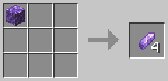
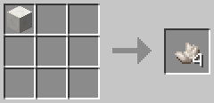

# Avid Uncrafting

This mod adds crafting recipes for the crafting table:
- amethyst block → 4x amethyst shard

    

- quartz block → 4x quartz

    

## Why do this?
I, personally, was annoyed that I could not craft amethyst blocks and quartz blocks back into their respective components like I could with several other items in minecraft (e.g.: diamond, lapis lazuli, iron).

